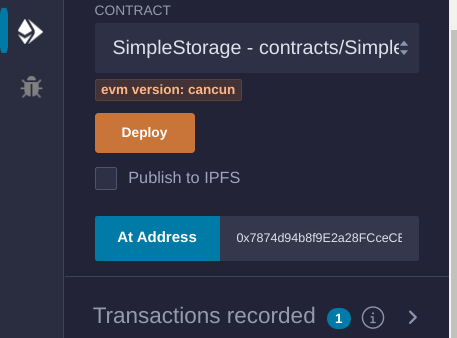

# Berinteraksi dengan Kontrak yang Telah Di-deploy

Setelah men-deploy smart contract di blockchain Ethereum, langkah penting berikutnya adalah berinteraksi dengan kontrak tersebut untuk membaca atau mengubah statusnya. Interaksi ini bisa dilakukan melalui berbagai tools dan library, yang paling populer adalah Web3.js dan Ethers.js. Library ini memungkinkan kamu untuk memanggil fungsi dalam smart contract, sehingga dapat berinteraksi dengan blockchain secara terprogram.

## Menggunakan Web3.js

Web3.js adalah library JavaScript yang komprehensif yang dirancang untuk berinteraksi dengan blockchain Ethereum. Library ini menyediakan cara yang mudah untuk mengakses dan memanipulasi smart contract, membaca statusnya, atau untuk mengirimkan transaksi.

**Contoh:**

```javascript
const Web3 = require("web3");
const web3 = new Web3("https://mainnet.infura.io/v3/YOUR_INFURA_PROJECT_ID");

const contractAddress = "0xYourContractAddress";
const abi = [
   /* ABI generated by the compiler */
];

const contract = new web3.eth.Contract(abi, contractAddress);

// Reading data
contract.methods.get().call().then(console.log);

// Writing data
contract.methods.set(42).send({ from: "0xYourAddress" }).then(console.log);
```

Dalam contoh ini, Web3.js terhubung ke Ethereum mainnet melalui Infura, penyedia infrastruktur blockchain. Alamat kontrak dan ABI (Application Binary Interface) digunakan untuk membuat instance kontrak. Metode `get` digunakan untuk membaca data dari blockchain, sedangkan metode `set` mengirimkan transaksi untuk mengubah status kontrak.

## Menggunakan Ethers.js

Ethers.js adalah library JavaScript lain yang dikenal karena mudah dan ukurannya yang kecil. Library ini sering digunakan untuk berinteraksi dengan blockchain Ethereum, menawarkan fungsionalitas yang mirip dengan Web3.js tetapi dengan pendekatan yang sedikit berbeda.

**Contoh:**

```javascript
const { ethers } = require("ethers");
const provider = new ethers.providers.JsonRpcProvider(
   "https://mainnet.infura.io/v3/YOUR_INFURA_PROJECT_ID"
);
const wallet = new ethers.Wallet("YOUR_PRIVATE_KEY", provider);

const contractAddress = "0xYourContractAddress";
const abi = [
   /* ABI generated by the compiler */
];

const contract = new ethers.Contract(contractAddress, abi, wallet);

// Reading data
contract.get().then(console.log);

// Writing data
contract.set(42).then((transaction) => {
   console.log(transaction);
});
```

Di contoh ini, Ethers.js terhubung dengan Ethereum melalui provider RPC yang bisa didapatkan secara public atau private di Infura. Lalu wallet instance dibuat dengan private key, yang mana akan digunakan agar bisa signing atau menandatangani transaksi. Kemudian contract instance dipanggil dengan method `get` untuk membaca data dan `set` untuk menulis data ke dalam blockchain.

## Menggunakan Remix

Remix bisa digunakan untuk berinteraksi langsung dengan kontrak yang sudah kita buat dengan cara memasukkan contract address dan ABI di menu tab “Deploy & Run Transactions”.



## Apa itu ABI

Application Binary Interface (ABI) adalah komponen penting untuk berinteraksi dengan smart contract. Di dalamnya terdapat array JSON yang mendefinisikan metode dan event dari sebuah kontrak, memungkinkan library seperti Web3.js dan Ethers.js untuk berinteraksi dengan fungsi dan event dari kontrak tersebut.

**Cara mendapatkan ABI:**

-  **Compile Contract:** Ketika kamu mengkompilasi kontrak Solidity menggunakan tools seperti solc (Solidity compiler) atau IDE seperti Remix, ABI dihasilkan sebagai bagian dari output kompilasi.
-  **Dari Truffle atau Hardhat:** Jika kamu menggunakan Truffle atau Hardhat untuk pengembangan, ABI akan di-generate otomatis dan disimpan di folder `build/contracts` atau `artifacts`.

**Perintah kompilasi di Hardhat:**

```bash
npx hardhat compile
```

Setelah kompilasi, ABI bisa ditemukan di folder `artifacts` dengan JSON sebagai isi dari outputnya.

**Menggunakan Remix:** Ketika kamu melakukan kompilasi di Remix, kamu bisa mendapatkan ABI pada tab Compilation. Di situ terdapat tombol untuk menyalin isi ABI dalam bentuk JSON.

**Contoh format ABI:**

```json
[
   {
      "constant": false,
      "inputs": [
         {
            "name": "_value",
            "type": "uint256"
         }
      ],
      "name": "set",
      "outputs": [],
      "payable": false,
      "stateMutability": "nonpayable",
      "type": "function"
   }
]
```
