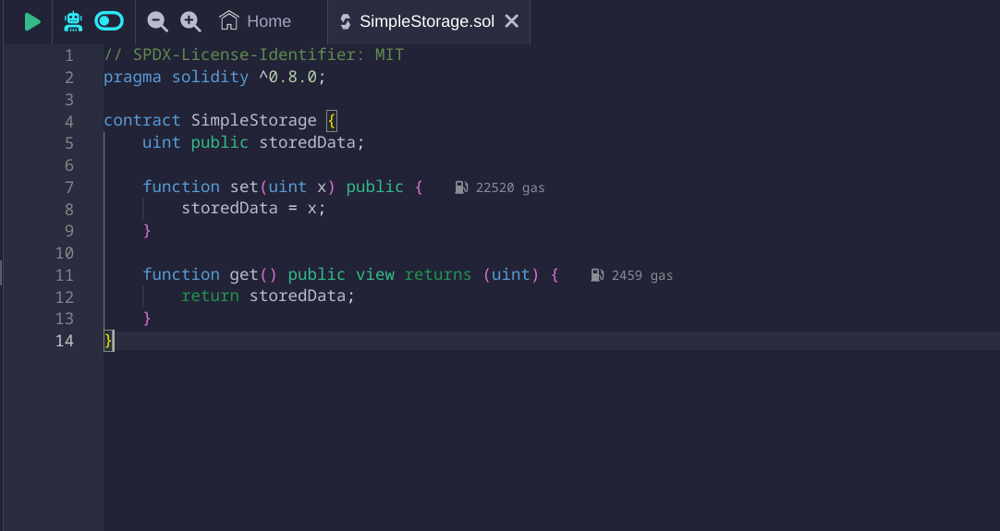
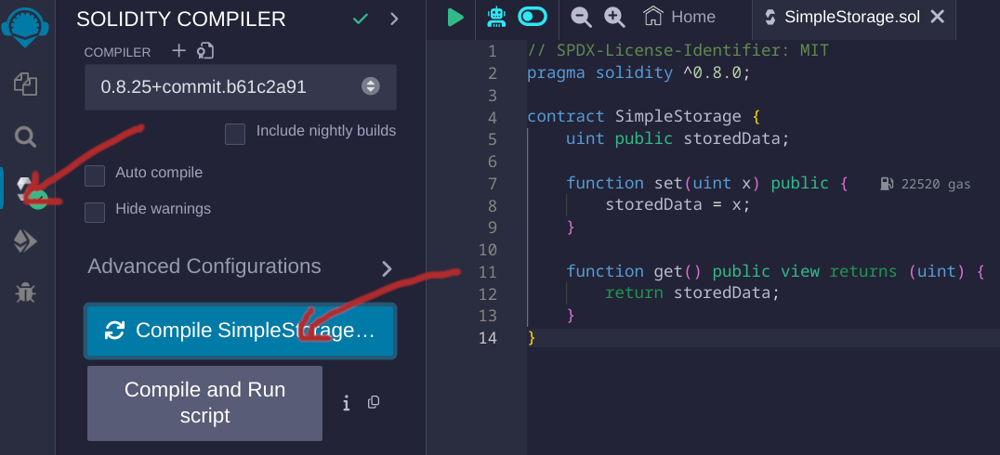
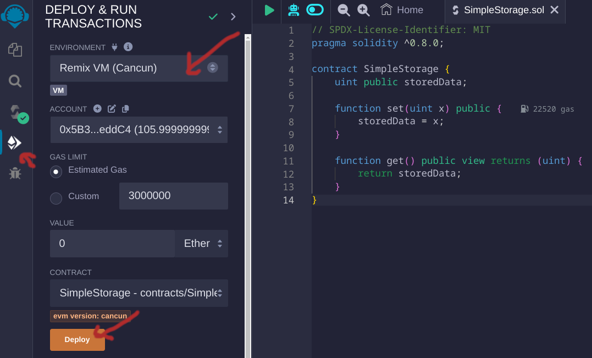

# Deployment pada Smart Contract

Men-deploy sebuah smart contract akan melalui proses dari kompilasi kode Solidity sampai mengirimkannya ke jaringan Ethereum. Proses deploy ini mencakup pembuatan instance baru dari kontrak tersebut pada script dan menampilkan alamat atau address pada Blockchain.

## Tahapan - tahapan

### Menulis dan Mengkompilasi contract

Dengan menggunakan Solidity compiler untuk mengubah kode Solidity menjadi bytecode yang dapat dipahami oleh Ethereum Virtual Machine (EVM) agar bisa di eksekusi.

**Contoh:**

```solidity
// SPDX-License-Identifier: MIT
pragma solidity ^0.8.0;

contract SimpleStorage {
    uint public storedData;

    function set(uint x) public {
        storedData = x;
    }

    function get() public view returns (uint) {
        return storedData;
    }
}
```

### Menggunakan Remix

Remix adalah IDE online untuk pengembangan Solidity yang menyederhanakan proses deployment.

1. Buat sebuah contract baru.

   

2. Lakukan kompilasi.

   

3. Pada tab "Deploy & Run Transactions", pilih environment yang sesuai (misalnya, JavaScript VM, Injected Web3 untuk MetaMask, dll.).

   

4. Klik "Deploy" untuk men-deploy kontrak ke jaringan yang dipilih.

### Deploy dengan Truffle

Truffle adalah development framework untuk Ethereum dengan segala tools untuk mempermudah pengembangan.

1. Buat project.
   ```bash
   truffle init
   ```
2. Tulis script untuk men-deploy di folder `migrations`

   ```javascript
   // 2_deploy_contracts.js
   const SimpleStorage = artifacts.require("SimpleStorage");

   module.exports = function (deployer) {
      deployer.deploy(SimpleStorage);
   };
   ```

3. Jalankan perintah berikut untuk deploy contract.
   ```bash
   truffle migrate
   ```

### Deploy menggunakan Hardhat

Hardhat merupakan alternatif dari truffle yang cukup populer dan banyak digunakan project besar saat ini.

1. Buat project atau menambahkan ke folder yang sudah ada.
   ```bash
   npx hardhat
   ```
2. Berikut contoh penulisan kode script untuk men-deploy.

   ```javascript
   async function main() {
      const SimpleStorage = await ethers.getContractFactory("SimpleStorage");
      const simpleStorage = await SimpleStorage.deploy();

      console.log("SimpleStorage deployed to:", simpleStorage.target);
   }

   main()
      .then(() => process.exit(0))
      .catch((error) => {
         console.error(error);
         process.exit(1);
      });
   ```

3. Deploy contract dengan menjalankan script sebelumnya.
   ```bash
   npx hardhat run scripts/deploy.js
   ```

## Contract Address

Setelah sebuah kontrak dideploy, kontrak tersebut memiliki alamat unik di jaringan Ethereum. Alamat ini digunakan untuk berinteraksi dengan kontrak tersebut.

**Contoh:**

```solidity
address public contractAddress;

function deployContract() public {
    SimpleStorage simpleStorage = new SimpleStorage();
    contractAddress = address(simpleStorage);
}
```
