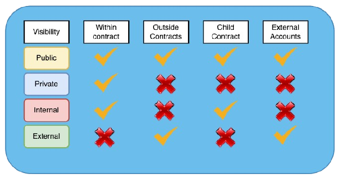
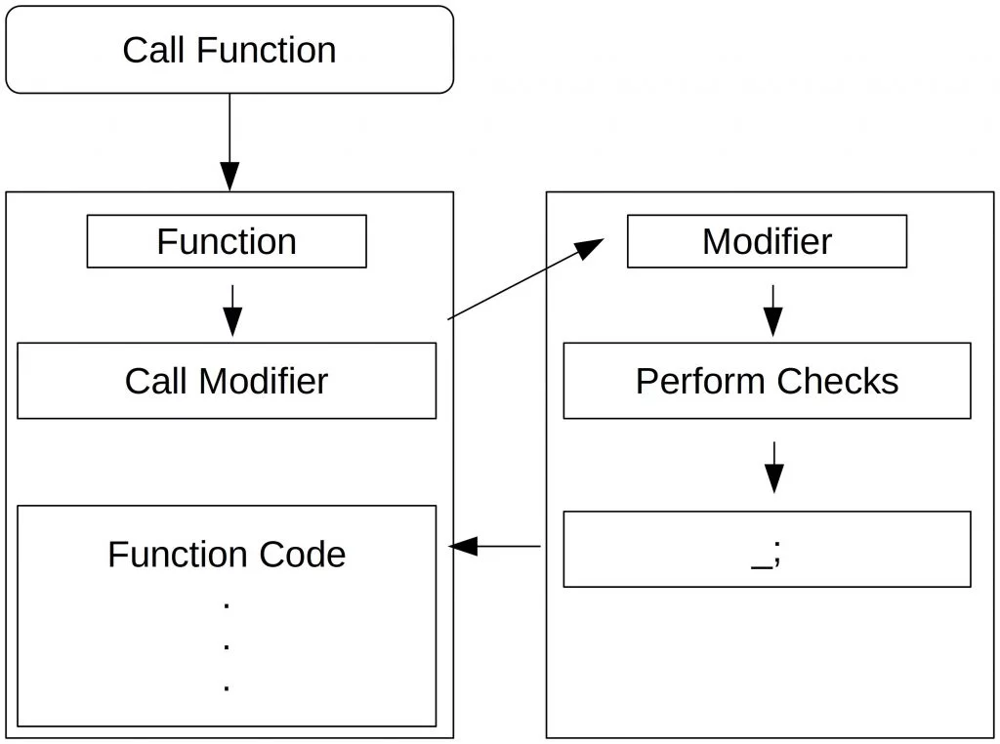
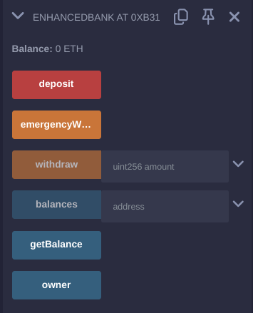

# 4. Control Flow dan Function

Memahami control flow dan function di Solidity sangat penting untuk membuat smart contract. Di bab ini kita akan membahas berbagai control flow yang ada di Solidity, cara mendefinisikan dan menggunakan function, serta cara memanfaatkan konsep-konsep ini untuk menulis smart contract yang baik.

## Control Flow di Solidity

Control Flow memungkinkan kamu untuk mengontrol alur eksekusi di dalam smart contract Anda. Solidity mendukung berbagai struktur kontrol, termasuk pernyataan kondisional dan loop.

### Conditional Statement

Conditional statement digunakan untuk mengeksekusi kode berdasarkan kondisi tertentu.

#### If Statement

`if` statement akan mengeksekusi sebuah blok kode jika kondisi yang ditentukan bernilai true.

```solidity
if (condition) {
    // code to execute if condition is true
}
```

Contoh:

```solidity
uint x = 10;
if (x > 5) {
    // This code will execute because x is greater than 5
    x = x + 1;
}
```

#### If-Else Statement

`if-else` statement akan mengeksekusi satu blok kode jika kondisi bernilai true, dan blok lain jika kondisi bernilai false.

```solidity
if (condition) {
    // code to execute if condition is true
} else {
    // code to execute if condition is false
}
```

Contoh:

```solidity
uint x = 10;
if (x > 15) {
    // This code will not execute because x is not greater than 15
    x = x + 1;
} else {
    // This code will execute because the condition is false
    x = x - 1;
}
```

#### Else-If Statement

`else-if` statement akan digunakan untuk mengecek conditional yang lebih dari satu.

```solidity
if (condition1) {
    // code to execute if condition1 is true
} else if (condition2) {
    // code to execute if condition2 is true
} else {
    // code to execute if both conditions are false
}
```

Contoh:

```solidity
uint x = 10;
if (x > 15) {
    // This code will not execute
    x = x + 1;
} else if (x > 5) {
    // This code will execute because x is greater than 5
    x = x + 2;
} else {
    // This code will not execute
    x = x - 1;
}
```

### Looping Statements

Perulangan digunakan untuk mengeksekusi kode berulang kali tanpa harus menuliskan kode yang sama.

#### For Loop

`for` loop digunakan ketika jumlah iterasi sudah diketahui.

```solidity
for (initialization; condition; iteration) {
    // code to execute repeatedly
}
```

Contoh:

```solidity
uint sum = 0;
for (uint i = 0; i < 10; i++) {
    sum = sum + i;
}
```

#### While Loop

`while` loop digunakan ketika jumlah iterasi tidak diketahui dan berdasarkan dari conditional apakah bernilai true.

```solidity
while (condition) {
    // code to execute repeatedly
}
```

Contoh:

```solidity
uint i = 0;
uint sum = 0;
while (i < 10) {
    sum = sum + i;
    i = i + 1;
}
```

#### Do-While Loop

`do-while` loop mirip seperti `while` loop, perbedaannya itu kode blok di dalamnya akan dieksekusi minimal sekali sebelum di cek conditional nya.

```solidity
do {
    // code to execute repeatedly
} while (condition);
```

Contoh:

```solidity
uint i = 0;
uint sum = 0;
do {
    sum = sum + i;
    i = i + 1;
} while (i < 10);
```

## Function di Solidity

Function adalah salah satu komponen utama dari smart contract di Solidity. Yang memungkinkan kamu untuk mengenkapsulasi kode ke dalam komponen yang dapat digunakan kembali berulang kali tanpa harus menuliskannya kembali.

### Mendefinisikan Function

Function di Solidity didefinisikan menggunakan keyword `function` diikuti dengan nama fungsi, parameter, visibilitas, dan isi kode dari fungsi itu sendiri. Berikut adalah struktur sintaksnya:

```solidity
function functionName(type parameter) visibility returns (type) {
    // function body
}
```

### Visibilitas Function



Visibilitas menentukan siapa yang dapat memanggil sebuah fungsi:

-  **Public**: Dapat dipanggil oleh akun eksternal atau fungsi internal.

   ```solidity
   function set(uint x) public {
       storedData = x;
   }
   ```

-  **External**: Hanya dapat dipanggil dari akun eksternal atau kontrak lain, tidak dapat dipanggil secara internal.

   ```solidity
   function set(uint x) external {
       storedData = x;
   }
   ```

-  **Internal**: Hanya dapat dipanggil di dalam kontrak saat ini atau kontrak turunan.

   ```solidity
   function increment() internal {
       storedData += 1;
   }
   ```

-  **Private**: Hanya dapat dipanggil di dalam kontrak saat ini.

   ```solidity
   function decrement() private {
       storedData -= 1;
   }
   ```

### State-Changing and View Functions

Function di Solidity dapat mengubah state atau nilai variabel kontrak atau hanya mengembalikan nilai:

-  **State-Changing Functions**: melakukan update pada value.

   ```solidity
   function set(uint x) public {
       storedData = x;
   }
   ```

-  **View Functions**: Function ini hanya mengembalikan nilai sesuai tipe data yang ditentukan.

   ```solidity
   function get() public view returns (uint) {
       return storedData;
   }
   ```

-  **Pure Functions**: Function ini digunakan untuk mengembalikan nilai tanpa terpengaruh oleh state external.

   ```solidity
   function add(uint a, uint b) public pure returns (uint) {
       return a + b;
   }
   ```

### Function Parameters dan Return Values

Functions can take multiple parameters and return multiple values:

```solidity
function multiply(uint a, uint b) public pure returns (uint product) {
    product = a * b;
}
```

### Function Modifier

Modifier adalah fitur yang cukup penting di Solidity yang memungkinkan kamu untuk mendefinisikan kode yang dapat digunakan kembali untuk dijalankan sebelum dan/atau sesudah eksekusi sebuah function. Yang mana biasanya digunakan untuk mengimplementasikan akses kontrol, validasi, dan lainnya.



#### Mendefinisikan Modifier

Modifier didefinisikan menggunakan keyword `modifier` diikuti dengan nama modifier dan logic dari modifier. Simbol khusus `_` menunjukkan di mana fungsi berikutnya akan dieksekusi.

```solidity
modifier onlyOwner() {
    require(msg.sender == owner, "Not the contract owner");
    _;
}
```

#### Menggunakan Modifier

Modifier diterapkan pada sebuah function dengan menambahkan nama modifier ke definisi function:

```solidity
address public owner;

constructor() {
    owner = msg.sender;
}

modifier onlyOwner() {
    require(msg.sender == owner, "Not the contract owner");
    _;
}

function set(uint x) public onlyOwner {
    storedData = x;
}
```

#### Built-in Modifier

Solidity menyediakan beberapa built-in modifier:

-  **payable**: fungsi yang ditandai modifier `payable` bisa menerima Ether.

   ```solidity
   function deposit() public payable {
       balances[msg.sender] += msg.value;
   }
   ```

-  **pure** and **view**: Seperti yang sudah dibahas sebelumnya, ini digunakan ketika tidak melakukan perubahan atau mengambil nilai dari suatu variabel state.

### Contoh: Enhanced Bank Contract

Mari kita ubah kontrak SimpleBank sebelumnya dengan beberapa fungsi dan modifier baru untuk tujuan kontrol dan keamanan yang lebih baik.

```solidity
// SPDX-License-Identifier: MIT
pragma solidity ^0.8.0;

contract EnhancedBank {
    address public owner;
    mapping(address => uint) public balances;

    constructor() {
        owner = msg.sender;
    }

    modifier onlyOwner() {
        require(msg.sender == owner, "Not the contract owner");
        _;
    }

    function deposit() public payable {
        balances[msg.sender] += msg.value;
    }

    function withdraw(uint amount) public {
        require(balances[msg.sender] >= amount, "Insufficient balance");
        payable(msg.sender).transfer(amount);
        balances[msg.sender] -= amount;
    }

    function getBalance() public view returns (uint) {
        return balances[msg.sender];
    }

    function emergencyWithdraw() public onlyOwner {
        payable(owner).transfer(address(this).balance);
    }
}
```

Dalam versi yang ditingkatkan ini, kita telah menambahkan:

-  Modifier `onlyOwner` untuk membatasi beberapa fungsi hanya bisa dipanggil oleh pemilik kontrak.
-  Function `emergencyWithdraw` yang memungkinkan pemilik untuk menarik semua dana dalam kasus tertentu.


