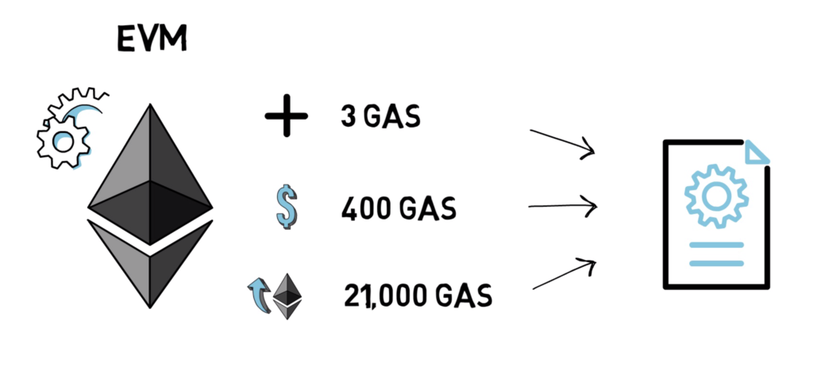

# Mengidentifikasi Operasi Berbiaya Gas Tinggi

Untuk mengoptimalkan smart contract, penting untuk mengidentifikasi operasi yang biasanya memerlukan banyak gas. Beberapa operasi yang berbiaya gas tinggi meliputi:

## Operasi Penyimpanan

-  **Writing to Storage**: setiap kali data ditulis ke penyimpanan state Ethereum, biaya gasnya tinggi karena sifat penyimpanan blockchain yang permanen.
-  **Updating Storage**: mengubah nilai yang sudah ada di penyimpanan juga memerlukan gas yang signifikan karena blockchain harus memperbarui informasi yang tersimpan.
-  **Deleting Storage**: meskipun menghapus nilai dari penyimpanan terkadang lebih murah dibandingkan menulis, hal ini tetap akan mengkonsumsi gas yang cukup besar.

## Perhitungan dan Perulangan

-  **Perhitungan Kompleks**: operasi matematika yang intensif, terutama yang melibatkan banyak langkah atau yang berpresisi tinggi, bisa mahal dalam hal gas.
-  **Perulangan**: melakukan iterasi pada array atau menjalankan banyak operasi dalam perulangan dapat menyebabkan konsumsi gas yang tinggi, terutama jika jumlah iterasinya besar.

## Panggilan Eksternal (External Call)

-  **Contract Calls**: berinteraksi dengan smart contract lain umumnya lebih mahal daripada menjalankan fungsi internal karena overhead tambahan.
-  **Oracles dan External Data**: mengambil data dari oracle atau sumber eksternal lainnya menambah biaya gas karena adanya komputasi dan pengambilan data tambahan.

# Teknik untuk Mengurangi Biaya Gas

Untuk mengurangi biaya gas dan meningkatkan efisiensi smart contract, beberapa teknik dan praktik terbaik dapat diterapkan:

## Menggunakan Struktur Data yang Efisien

-  **Mapping daripada Array**: lebih baik menggunakan mapping daripada array untuk penyimpanan jika memungkinkan. Mapping memungkinkan mekanisme pencarian dan modifikasi yang lebih murah dan efisien.
-  **Struct Packing**: optimalkan penggunaan penyimpanan dengan menggabungkan beberapa variabel kecil ke dalam satu slot penyimpanan, sehingga mengurangi jumlah operasi penyimpanan secara keseluruhan.

## Meminimalkan Penulisan ke Storage

-  **Operasi Read-only**: pisahkan operasi baca-saja dari yang memodifikasi state. Operasi read-only tidak mengkonsumsi gas, sehingga harus dipisahkan untuk menghindari biaya yang tidak perlu.
-  **Operasi Batch**: gabungkan beberapa operasi dalam satu transaksi untuk mengurangi overhead yang terkait dengan banyak transaksi.
-  **Gunakan Memori dan Stack**: lakukan perhitungan di memori atau di stack alih-alih menulis ke penyimpanan, karena operasi memori dan stack lebih murah.

## Optimisasi kode Solidity

-  **Short-Circuiting**: gunakan operator logika `&&` dan `||` yang short-circuit untuk menghindari perhitungan yang tidak perlu. Misalnya, dalam `if (a && b)`, jika `a` bernilai false, maka `b` tidak dievaluasi.
-  **Unroll Loops**: lakukan unroll pada perulangan jika memungkinkan untuk mengurangi jumlah iterasi dan, dengan demikian dapat mengurangi gas yang digunakan.
-  **Hindari Operasi Redundan**: hapus perhitungan yang duplikat atau tidak perlu dalam fungsi untuk memperlancar eksekusi kode.

## Perhatikan Desain Contract

-  **Variabel Immutable**: gunakan keyword `immutable` untuk variabel yang hanya ditetapkan sekali dan tidak pernah berubah, sehingga mengurangi biaya gas untuk akses berikutnya.
-  **Fungsi Constant dan View**: gunakan fungsi `constant` dan `view` untuk operasi yang tidak memodifikasi state. Fungsi-fungsi ini tidak mengkonsumsi gas saat dipanggil secara eksternal.
-  **Fungsi Fallback**: gunakan fungsi fallback dengan hati-hati agar tidak mengonsumsi gas secara tidak sengaja. Pastikan fungsi fallback dioptimalkan dan tidak melakukan operasi yang rumit.
