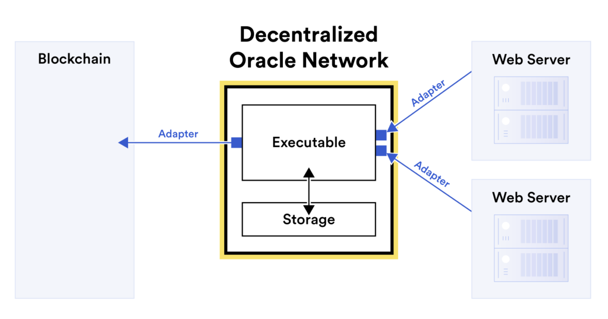
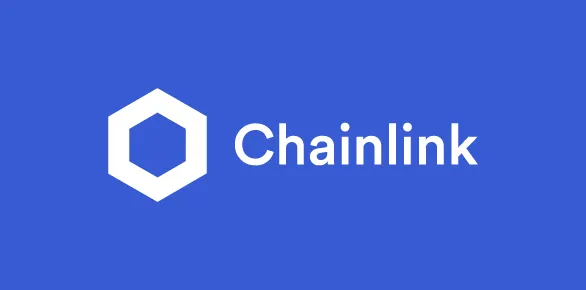

# 14. Pattern Oracle dan Data Off-Chain

Dalam ranah smart contract, kemampuan untuk mengakses dan menggunakan data off-chain sangat penting untuk menciptakan aplikasi terdesentralisasi (dApps) yang dinamis dan responsif. Oracle berfungsi sebagai jembatan antara lingkungan on-chain dan off-chain, sehingga membuat smart contract dapat mengakses ke data eksternal. Pada bab ini kita akan membahas integrasi oracle, dengan fokus pada penggunaan Chainlink dan layanan oracle lainnya, serta bagaimana best practice nya untuk integrasi data yang baik.



## Mengintegrasikan Oracle untuk Data Off-Chain

Oracle adalah sebuah layanan pihak ketiga (third-party) yang menyediakan data eksternal untuk smart contract. Dengan oracle memungkinkan smart contract berinteraksi dengan dunia nyata dengan mengambil data seperti harga pasar, informasi cuaca, dan lainnya. Di bab ini kita akan membahas bagaimana pentingnya oracle, cara kerjanya, dan cara mengintegrasikannya ke dalam proyek Solidity kamu menggunakan layanan seperti Chainlink dan Provable.

### Mengapa Oracle penting?

-  **Smart Contract yang Dinamis**: oracle memungkinkan smart contract bereaksi terhadap peristiwa di dunia nyata, sehingga aplikasi dapat menjadi lebih dinamis dan responsif.
-  **Verifikasi Data**: oracle dapat memastikan keandalan dan keaslian data off-chain, hal yang penting untuk menjaga kepercayaan dalam aplikasi terdesentralisasi.
-  **Otomatisasi**: oracle memungkinkan eksekusi otomatis smart contract berdasarkan data waktu nyata, sehingga meningkatkan fungsionalitas dan kegunaan smart contract.

### Cara kerja Oracle

1. **Permintaan Data**  
   Dalam sistem blockchain, smart contract tidak dapat langsung mengakses data dari sumber off-chain seperti internet atau basis data eksternal karena sifatnya yang deterministik dan terisolasi. Untuk mengatasi batasan ini, smart contract menggunakan oracle. Proses dimulai dengan smart contract yang menginisiasi permintaan data ke oracle, yang biasanya menentukan jenis data yang dibutuhkan dan parameter yang diperlukan untuk mengambil data, seperti endpoint API.

2. **Pengambilan Data**  
   Setelah oracle menerima permintaan data dari smart contract, oracle bertugas mengambil data yang diminta dari sumber off-chain. Oracle merupakan komponen khusus yang dirancang untuk berinteraksi dengan sistem eksternal dan mengambil data dari dunia nyata. Oracle dapat berkomunikasi dengan API, basis data, perangkat IoT, dan sumber eksternal lainnya tergantung pada sifat data yang diminta. Langkah ini mencakup pengambilan data dengan aman sesuai protokol nya dan langkah-langkah keamanan yang telah ditentukan sebelumnya.

3. **Pengiriman Data**  
   Setelah berhasil mengambil data yang diminta, oracle kemudian mengirimkan data ini kembali ke smart contract yang mengajukan permintaan awal. Data yang dikirim biasanya diformat dan ditransmisikan dengan cara yang dapat diinterpretasikan dan digunakan oleh smart contract. Hal ini bisa melibatkan pengemasan data ke dalam struktur data tertentu yang kompatibel dengan data blockchain, sehingga memastikan bahwa smart contract dapat memvalidasi dan memproses data tersebut sesuai kebutuhan.

### Menggunakan Chainlink dan Layanan Oracle Lainnya

Chainlink adalah jaringan oracle terdesentralisasi yang paling banyak digunakan, terkenal karena keamanannya dan kehandalannya. Chainlink menyediakan input dan output yang aman dari gangguan untuk smart contract, sehingga memungkinkan integrasi data off-chain.



#### Persiapan Chainlink di project Smart Contract

1. **Install Chainlink**  
   Pertama, instal library Chainlink di proyek kamu:

   ```bash
   npm install @chainlink/contracts
   ```

2. **Implementasikan Chainlink kedalam Smart Contract**  
   Berikut adalah contoh cara mengambil harga ETH/USD menggunakan Chainlink:

   ```solidity
   // SPDX-License-Identifier: MIT
   pragma solidity ^0.8.0;

   import "@chainlink/contracts/src/v0.8/interfaces/AggregatorV3Interface.sol";

   contract PriceConsumerV3 {
        AggregatorV3Interface internal priceFeed;

        /**
         * Network: Rinkeby
         * Aggregator: ETH/USD
         * Address: 0x8A753747A1fa494EC906cE90E9f37563A8AF630e
         */
        constructor() {
             priceFeed = AggregatorV3Interface(0x8A753747A1fa494EC906cE90E9f37563A8AF630e);
        }

        /**
         * Returns the latest price
         */
        function getLatestPrice() public view returns (int) {
             (
                   /* uint80 roundID */,
                   int price,
                   /* uint startedAt */,
                   /* uint timeStamp */,
                   /* uint80 answeredInRound */
             ) = priceFeed.latestRoundData();
             return price;
        }
   }
   ```

### Menggunakan Layanan Oracle Lainnya

Meskipun Chainlink adalah yang paling populer, tersedia juga layanan oracle lainnya:

-  **Band Protocol**: layanan oracle terdesentralisasi yang fokus pada fleksibilitas dan kustomisasi data.
-  **API3**: menyediakan API terdesentralisasi agar smart contract dapat berinteraksi dengan data dunia nyata.

### Best Practices untuk integrasi Oracle

Mengintegrasikan data off-chain ke dalam smart contract bisa mendatangkan beberapa risiko dan tantangan. Dengan mengikuti best practice akan membantu memastikan keandalan dan keamanan dApp yang kamu buat.

#### Pertimbangan Keamanan

-  **Kontrol Akses**: disarankan untuk menerapkan kontrol akses supaya memastikan hanya oracle yang berwenang yang dapat memperbarui data.
-  **Kesesuaian Data**: pastikan data selalu terbaru dan relevan dengan mengatur interval waktu yang sesuai untuk pengambilan data.
-  **Penanganan Error**: Implementasikan penanganan error (error handling) yang baik untuk mengelola kegagalan pengambilan data dan pastikan ada mekanisme cadangan.

#### Manajemen Biaya

-  **Query yang Efisien**: optimalkan frekuensi dan kompleksitas query oracle untuk mengelola biaya.
-  **Perhitungan Off-Chain**: Jika memungkinkan, lakukan perhitungan kompleks di luar blockchain dan hanya membawa hasil perhitungan tersebut.
