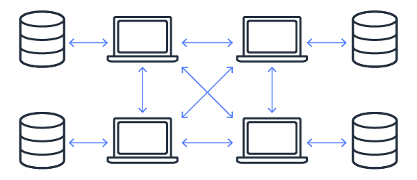
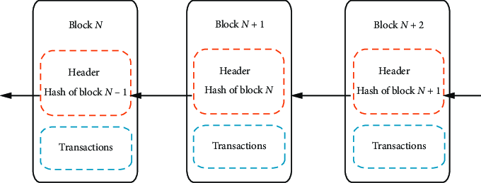
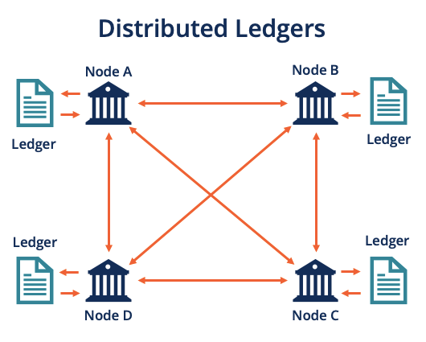

# Memahami Teknologi Blockchain

## Apa itu Blockchain?

Blockchain adalah teknologi Ledger ter-desentralisasi yang memungkinkan pencatatan transaksi yang aman dan transparan di seluruh jaringan komputer. Berbeda dengan sistem terpusat tradisional, jaringan blockchain beroperasi secara peer-to-peer, di mana setiap peserta, atau node, memelihara salinan Ledger atau Database. Data dalam blockchain disimpan dalam blok yang terhubung satu sama lain secara kronologis membentuk seperti rantai, karena itulah disebut rantai blok.

## Karakteristik Utama Blockchain

-  Desentralisasi: Dalam blockchain, tidak ada satu entitas pun yang memiliki kendali atas jaringan. Sebaliknya, setiap peserta memiliki otoritas yang sama dan dapat memvalidasi transaksi, memastikan data yang tersebar dan valid.
-  Transparansi: Teknologi blockchain memastikan bahwa semua transaksi terlihat oleh semua orang. Tingkat transparansi ini mendorong akuntabilitas dan membangun kepercayaan di antara pengguna, karena setiap transaksi dapat diverifikasi secara independen.
   -Imutabilitas: Setelah data dicatat dalam blockchain, data tersebut tidak dapat diubah atau dihapus. Imutabilitas ini menjamin catatan yang permanen dan tidak dapat diubah, meningkatkan kredibilitas data yang disimpan.
-  Keamanan: Blockchain menggunakan teknik kriptografi untuk mengamankan data, menjadikannya sangat tahan terhadap gangguan dan pemalsuan. Langkah-langkah keamanan ini melindungi integritas data dan privasi pengguna.

## Jenis Jaringan Blockchain

-  Blockchain Publik: Terbuka untuk siapa saja yang ingin berpartisipasi dan memvalidasi transaksi. Contohnya termasuk Bitcoin dan Ethereum, yang dapat diakses oleh siapa saja dengan koneksi internet.
-  Blockchain Privat: Jaringan ini dibatasi untuk kelompok peserta tertentu, biasanya digunakan oleh organisasi untuk tujuan internal. Akses dikendalikan, dan hanya peserta yang diotorisasi yang dapat memvalidasi transaksi.
-  Blockchain Konsorsium: Dikendalikan oleh sekelompok organisasi, blockchain konsorsium menggabungkan fitur dari blockchain publik dan privat. Mereka menawarkan keseimbangan antara transparansi dan privasi, membuatnya cocok untuk proyek kolaboratif dalam suatu bisnis.

## Cara Kerja Blockchain

1. Inisiasi Transaksi
   Proses blockchain dimulai dengan inisiasi transaksi, yang bisa berupa apa saja dari transfer cryptocurrency antara dua pihak hingga pencatatan Smart Contract atau jenis data lainnya. Setelah dibuat, transaksi ini disebarkan ke seluruh jaringan komputer, yang dikenal sebagai node, yang berpartisipasi dalam blockchain.

   

2. Validasi Transaksi
   Setelah transaksi dibuat dan disebarkan ke jaringan, transaksi tersebut harus divalidasi. Node dalam jaringan memainkan peran penting dalam langkah ini dengan memvalidasi transaksi untuk memastikan keabsahannya. Proses validasi ini menggunakan mekanisme konsensus, yaitu protokol yang memastikan semua node setuju dengan keabsahan transaksi. Dua mekanisme konsensus yang paling umum adalah:

       - Proof of Work (PoW): Dalam PoW, node (disebut penambang) bersaing untuk memecahkan teka-teki matematika yang kompleks. Penambang pertama yang memecahkan teka-teki mendapat hak untuk memvalidasi transaksi dan diberi hadiah, memastikan bahwa transaksi tersebut sah.
       - Proof of Stake (PoS): Dalam PoS, validator dipilih berdasarkan jumlah koin yang mereka pegang dan bersedia “taruhkan” sebagai jaminan. Validator dipilih untuk memvalidasi transaksi dan membuat blok baru berdasarkan jaminannya dan faktor lain seperti lamanya waktu jaminan yang mereka taruh.

       Mekanisme ini mencegah transaksi curang dan memastikan integritas blockchain.

3. Pembuatan Blok
   Setelah transaksi divalidasi, transaksi tersebut digabungkan dengan transaksi yang sudah divalidasi lainnya untuk membentuk sebuah blok. Blok baru ini berisi daftar transaksi terbaru, waktu, dan referensi ke blok sebelumnya, di antara data lainnya. Proses pembuatan blok baru biasanya melibatkan penambahan identifier, yang disebut hash, yang merupakan representasi kriptografi dari data blok.

   

4. Penambahan Blok
   Blok baru kemudian ditambahkan ke blockchain. Blok ini terhubung secara kriptografi ke blok sebelumnya melalui hash-nya, menciptakan rantai blok (disebut blockchain). Hal ini memastikan bahwa setiap blok terhubung dengan pendahulunya, membuatnya sulit untuk mengubah satu blok tanpa mengubah semua blok berikutnya.

5. Pembaruan Ledger
   Setelah blok baru ditambahkan ke blockchain, semua node dalam jaringan memperbarui salinan blockchain mereka untuk memperbarui penambahan ini. Proses pembaruan terdistribusi ini memastikan bahwa setiap node memiliki salinan identik dari blockchain, mempertahankan konsistensi dan transparansi di seluruh jaringan. Karena blockchain terdistribusi dan setiap node memiliki salinannya, blockchain sangat tahan terhadap gangguan dan pemalsuan, karena mengubah satu salinan tidak cukup untuk mengubah informasi di seluruh jaringan.

   

## Manfaat dan Tantangan Blockchain

**Manfaat:** Teknologi blockchain menawarkan keuntungan yang signifikan dengan teknologi desentralisasi, yang menghilangkan kebutuhan akan otoritas pusat dan mengurangi Single Point of Failure. Juga meningkatkan keamanan dengan menggunakan teknik kriptografi untuk melindungi data dari akses tidak sah dan manipulasi. Transparansi adalah manfaat lain yang penting, karena semua transaksi dicatat pada Public Ledger, memberikan akuntabilitas. Imutabilitas yang memastikan bahwa setelah data dicatat, data tersebut tidak dapat diubah. Selain itu, blockchain dapat meningkatkan efisiensi dengan mengotomatisasi dan merampingkan proses, yang mengurangi kebutuhan akan perantara.

**Tantangan:** Meskipun memiliki manfaat, teknologi blockchain menghadapi beberapa tantangan. Skalabilitas merupakan masalah utama, karena blockchain publik dapat kesulitan ketika menangani volume transaksi yang tinggi, yang menyebabkan waktu memproses transaksi lebih lambat dan biaya menjadi lebih tinggi. Konsumsi energi juga menjadi perhatian, terutama dengan mekanisme konsensus Proof of Work (PoW) yang sangat menguras energi. Ketidakpastian regulasi menimbulkan tantangan lain, karena pemerintah dan badan pengawas masih menentukan cara mengatur blockchain dan cryptocurrency.
