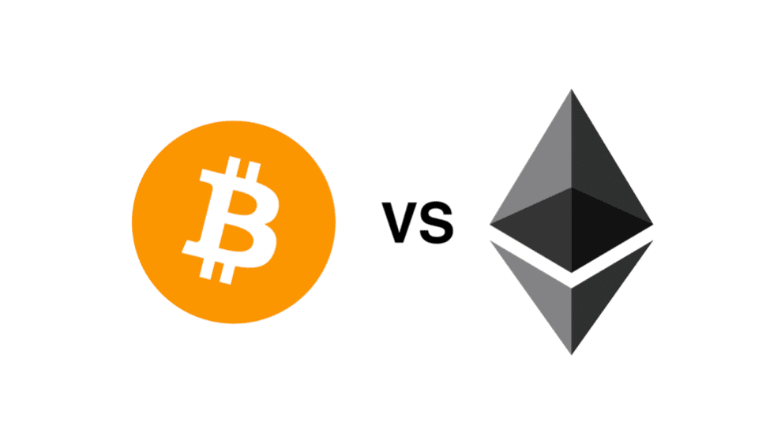
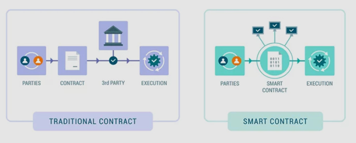

# Peran Ethereum dalam Blockchain

Ethereum adalah platform ter-desentralisasi yang memungkinkan pengembang untuk membangun dan mengimplementasikan smart contract serta aplikasi ter-desentralisasi (dApps). Platform ini diusulkan oleh Vitalik Buterin pada akhir 2013 dan pengembangannya dimulai pada awal 2014. Platform ini diluncurkan pada 30 Juli 2015, dengan supply awal 72 juta Ether (ETH) sebagai cryptocurrency bawaannya.

## Ethereum vs Bitcoin

Meskipun Bitcoin merupakan mata uang digital yang digunakan untuk mentransfer nilai, Ethereum adalah platform yang lebih serbaguna yang memungkinkan transaksi yang dapat diprogram melalui smart contract. Perbedaan utama meliputi:

**Tujuan:** Bitcoin dirancang untuk transaksi mata uang digital peer-to-peer. Ethereum dirancang untuk menjadi platform bagi aplikasi ter-desentralisasi dan smart contract.

**Smart Contract:** Ethereum mendukung smart contract Turing-complete, memungkinkan aplikasi yang lebih kompleks dan beragam dibandingkan dengan kemampuan skrip Bitcoin yang lebih terbatas.
Mekanisme Konsensus: Sementara keduanya awalnya menggunakan Proof of Work (PoW), Ethereum sudah bertransisi ke Proof of Stake (PoS) dengan peningkatan Ethereum 2.0.

## Smart Contract dan Kegunaannya

### Apa itu smart contract?

Smart contract adalah konsep yang revolusioner di dunia digital, sebuah kontrak yang bisa mengeksekusi sendiri di mana syarat-syarat perjanjian antara pembeli dan penjual langsung ditulis dalam baris kode. Tidak seperti kontrak tradisional, yang memerlukan pihak ketiga (seperti pengacara atau notaris) untuk mengawasi dan menegakkan syarat-syarat, smart contract secara otomatis mengeksekusi dan menegakkan syarat-syarat ketika kondisi yang telah ditentukan terpenuhi.

### Manfaat dari Smart Contract

**Otomatisasi:** Smart contract mengurangi kebutuhan akan perantara dengan mengotomatisasi proses dengan cara mengeksekusi secara otomatis ketika kondisi yang telah ditentukan terpenuhi, menghilangkan kebutuhan akan intervensi manual. Otomatisasi ini memastikan bahwa tugas-tugas diselesaikan dengan tepat sesuai yang diprogramkan sehingga meminimalkan risiko kesalahan manusia dan mempercepat proses.

**Transparansi:** Smart contract menawarkan transparansi. Semua pihak yang terlibat dalam kontrak dapat melihat code dan rules dari kontrak di blockchain. Transparansi ini membangun kepercayaan di antara peserta karena semua orang memiliki akses ke informasi yang sama dan tidak dapat diubah tentang aturan kontrak dan status pemenuhannya.

**Keamanan:** Smart contract menggunakan metode kriptografi untuk mengamankan kontrak dari pihak tidak diinginkan. Setelah smart contract dimasukan di blockchain, kontrak tersebut tidak dapat diubah. Imutabilitas ditambah dengan sifat ter-desentralisasi dari blockchain, membuat smart contract sangat tahan terhadap peretasan dan pemalsuan.

### Kasus Penggunaan Smart Contract

-  **Finansial Terdesentralisasi (DeFi)**
   Smart contract adalah kunci dari finansial ter-desentralisasi (DeFi), yang mana memungkinkan pembuatan instrumen keuangan seperti pinjaman, tabungan, dan asuransi tanpa perantara tradisional. Dalam DeFi, smart contract memfasilitasi pinjam-meminjam dan perdagangan secara peer-to-peer, menyediakan layanan keuangan yang tidak hanya mendemokratisasi akses ke layanan keuangan tetapi juga meningkatkan efisiensi dan transparansi mereka.

-  **Manajemen Supply Chain**
   Smart contract meningkatkan transparansi dalam manajemen rantai pasokan. Mereka dapat mengotomatisasi dan memverifikasi seluruh siklus rantai barang dari produksi hingga pengiriman. Dengan merekam setiap langkah di blockchain, smart contract memastikan bahwa semua peserta memiliki catatan perjalanan produk yang jelas dan tidak dapat diubah, meningkatkan akuntabilitas dan mengurangi risiko pemalsuan.

-  **Real Estat**
   Dalam real estat, smart contract dapat mengotomatisasi transaksi properti dan transfer kepemilikan. Mereka menyederhanakan proses jual beli dengan menangani pembayaran, memverifikasi kepemilikan, dan memperbarui catatan tanpa perlu perantara seperti agen escrow. Otomatisasi ini menyederhanakan transaksi, mengurangi biaya, dan mempercepat transfer kepemilikan properti.

-  **Sistem Pemungutan Suara**
   Smart contract dapat memastikan proses pemilihan yang aman dan transparan. Dengan merekam suara di blockchain, smart contract menyediakan metode pemungutan dan penghitungan suara yang tidak dapat dirusak atau diubah oleh pihak tertentu. Ini memastikan integritas proses pemungutan suara dan memungkinkan verifikasi hasil secara real-time, mengurangi risiko pemalsuan dan meningkatkan kepercayaan para pemilih.

-  **Gaming dan NFT**
   Dalam industri game dan dunia non-fungible token (NFT), smart contract memungkinkan kepemilikan dan perdagangan aset dalam game dan koleksi digital. Pemain dapat membeli, menjual, dan memperdagangkan aset seperti karakter, senjata, dan real estat virtual dengan aman. NFT mewakili item digital yang unik, dan smart contract memastikan keaslian dan kepemilikannya, memungkinkan pasar yang kokoh dan transparan untuk barang digital.

## Ekosistem Ethereum

### I. Ethereum Virtual Machine (EVM)

EVM adalah sebuah runtime untuk smart contract di jaringan Ethereum. yang mana memastikan bahwa kode smart contract dieksekusi dengan tepat seperti yang diharapkan di setiap node.

### II. Solidity

Solidity adalah bahasa pemrograman utama untuk menulis smart contract di Ethereum. Bahasa ini terinspirasi dari JavaScript, Python, dan C++, membuatnya dapat diakses oleh pengembang yang sudah terbiasa dengan bahasa-bahasa ini dan dirancang khusus untuk memanfaatkan kemampuan Ethereum.

### III. Tools

Ekosistem Ethereum didukung oleh berbagai tools pengembangan. Hardhat adalah sebuah framework yang membantu developer untuk menulis, menguji, dan menerapkan smart contract dengan lebih efisien, sedangkan Remix IDE menyediakan IDE online untuk menulis, menguji, dan men-deploy smart contract Solidity. Web3.js adalah library JavaScript yang memfasilitasi interaksi dengan blockchain Ethereum untuk membantu pengembangan dApps.

### IV. Ethereum Improvement Proposals (EIPs)

EIP adalah proposal untuk fitur baru terhadap peningkatan jaringan Ethereum. Proposal ini akan ditinjau dan diterima oleh komunitas, memastikan bahwa platform berkembang melalui proses yang digerakkan oleh konsensus dan suara dari komunitas.

## Contoh Aplikasi di Ethereum

### Finansial Terdesentralisasi (DeFi)

Platform DeFi seperti MakerDAO, Compound, dan Aave memungkinkan layanan keuangan seperti pinjaman, dan mendapatkan bunga atas aset kripto tanpa perantara. Pertukaran terdesentralisasi (DEX) seperti Uniswap memungkinkan perdagangan cryptocurrency peer-to-peer.

### Non-Fungible Tokens (NFTs)

NFT adalah aset digital unik yang mewakili kepemilikan item seperti seni, musik, dan aset dalam game. Platform seperti OpenSea dan Rarible memfasilitasi pembuatan, perdagangan, dan pengelolaan NFT.

### Decentralized Autonomous Organizations (DAOs)

DAO adalah organisasi yang diatur oleh smart contract daripada struktur manajemen tradisional. Anggota menggunakan token untuk memberikan suara pada proposal, memungkinkan pengambilan keputusan yang ter-desentralisasi dan tata kelola yang transparan.

### Kesehatan

Teknologi blockchain dapat digunakan untuk mengelola catatan pasien dengan aman dan memastikan integritas data. Proyek seperti MedRec memanfaatkan Ethereum untuk membuat jejak audit informasi medis yang tidak dapat dirusak atau diubah, meningkatkan keamanan dan keandalan manajemen data kesehatan.

### Gaming

Game berbasis blockchain dan dunia virtual memungkinkan pemain untuk memiliki dan memperdagangkan aset dalam game. Platform seperti Axie Infinity dan Decentraland memanfaatkan Ethereum untuk menjalankan ekosistem mereka.
