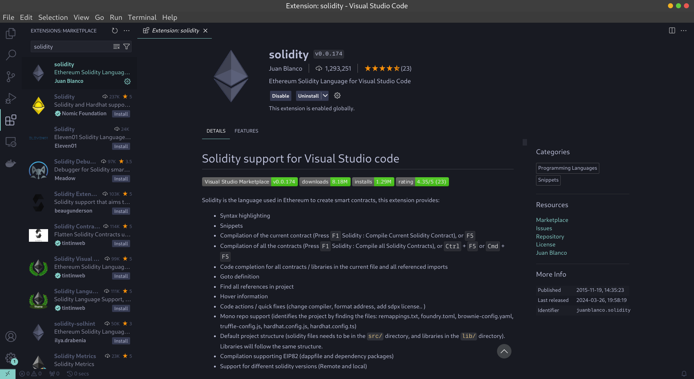

# Persiapan dengan Solidity

## Setting Up Development Environment

Sebelum mulai membuat smart contract dengan Solidity, sangat penting untuk menyiapkan Development Environment yang sesuai. Di Bab kita akan melakukan instalasi dan konfigurasi tools yang diperlukan agar kamu bisa mengikuti semua panduan di ebook ini.


### Install Node.js dan npm

Node.js adalah runtime JavaScript yang berperan penting untuk menjalankan berbagai tools. npm (Node Package Manager) di dalam Node.js akan digunakan untuk menginstal berbagai library yang diperlukan.

**Download Node.js:**

Kunjungi https://nodejs.org/ dan download versi **LTS (Long Term Support)** berdasarkan sistem operasi yang digunakan.

Install Node.js:

#### Cek Instalasi:

Buka terminal atau command prompt jalankan perintah:

```sh
node -v
npm -v
```

## 2. Pilih Framework

Karena Truffle sudah diarsipkan dan tidak dilanjutkan lagi project-nya, saya menyarankan agar kamu menggunakan framework **Hardhat** karena masih aktif dimaintain oleh tim pengembangnya sampai sekarang.

### Opsi 1: Install Hardhat

Hardhat adalah sebuah framework untuk pengembangan project Solidity yang fleksibel. Framework ini membantu developer melakukan kompilasi, deploy, testing, dan debugging.

#### Langkah-Langkah Install Hardhat:

1. **Buka terminal atau command prompt.**
2. **Buat sebuah folder project:**

   ```bash
   mkdir my-ethereum-project
   cd my-ethereum-project
   ```

3. **Lakukan inisialisasi untuk project Node.js:**

   ```bash
   npm init -y
   ```

4. **Install Hardhat:**

   ```bash
   npm install --save-dev hardhat
   ```

#### Setting Project Hardhat:

1. **Jalankan perintah berikut untuk melakukan inisiasi project:**

   ```bash
   npx hardhat init
   ```

2. **Ikuti prompt yang muncul pada terminal atau command prompt.**

#### Cek Instalasi:

Setelah melakukan inisiasi, kamu bisa cek perintah Hardhat lainnya dengan menjalankan perintah:

```bash
npx hardhat help
```

### Opsi 2: Install Truffle (Jika Lebih Memilih Truffle)

Truffle adalah sebuah framework dengan fungsi yang hampir mirip dengan Hardhat, namun memerlukan tambahan software **Ganache** untuk penggunaannya.

#### Langkah-Langkah Install Truffle:

1. **Install Truffle secara global:**

   ```bash
   npm install -g truffle
   ```

2. **Cek versi Truffle yang terinstal:**

   ```bash
   truffle version
   ```

## 3. Install Ganache (Jika Memakai Truffle)

**Ganache** adalah local blockchain yang dirancang khusus untuk pengembangan project Ethereum. Walaupun pengembangannya sudah dihentikan dan diarsipkan oleh developernya, kamu masih bisa menggunakannya.

### Langkah-Langkah Install Ganache:

1. **Download Ganache:**

   Kunjungi [https://trufflesuite.com/ganache/](https://trufflesuite.com/ganache/) dan unduh versi yang sesuai dengan OS kamu.

2. **Install Ganache:**

   Ikuti instruksi yang muncul saat proses instalasi.

3. **Buka Ganache:**
   Setelah terinstal, buka Ganache dan klik tombol **“Quickstart Ethereum”**. Jaringan blockchain lokal akan langsung berjalan di perangkat kamu.

## 4. Install Code Editor

**Visual Studio Code (VS Code)** sangat direkomendasikan untuk mengetik kode Solidity. VS Code memiliki berbagai ekstensi yang mendukung pengembangan project menggunakan Solidity.

### Langkah-Langkah Install VS Code:

1. **Download VS Code:**

   Kunjungi situs resmi [VS Code](https://code.visualstudio.com/) dan unduh versi sesuai OS kamu.

2. **Install VS Code:**

   Ikuti instruksi instalasi untuk OS kamu.

3. **Install Solidity Extension:**
   -  Buka VS Code.
   -  Pergi ke **Extensions view** dengan mengklik ikon Extensions di Activity Bar di sisi jendela atau tekan `Ctrl+Shift+X`.
   -  Cari **“Solidity”**.
   -  Install ekstensi Solidity yang dibuat oleh **Juan Blanco**.


