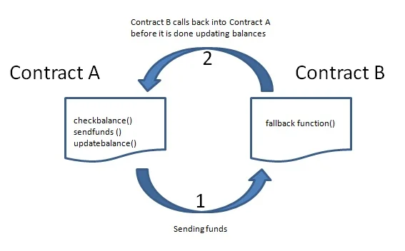

# Kerentanan Paling Umum

Beberapa kerentanan umum telah lama menjadi masalah dalam smart contract. Memahami vulnerability ini bisa menjadi langkah pertama untuk memahami bagaimana menulis kode yang aman.

## 1. Reentrancy

Serangan reentrancy terjadi ketika sebuah kontrak melakukan panggilan eksternal ke kontrak tidak terpercaya sebelum memperbarui statusnya. Hal ini memungkinkan kontrak tidak terpercaya untuk memanggil kembali ke kontrak asli, yang berpotensi menyebabkan perilaku tak terduga dan bahkan bisa berakhir menjadi pengurasan dana (drain). Kerentanan semacam ini sangat berbahaya dalam konteks transaksi yang melibatkan finansial dan dapat menyebabkan kerugian yang signifikan.

Untuk penjelasan lebih detail, kamu bisa langsung ke sumber artikel berikut: [Reentrancy Attack in a Solidity Smart Contract](https://cryptomarketpool.com/reentrancy-attack-in-a-solidity-smart-contract/).



### Contoh Kontrak yang Rentan

Kode Solidity berikut menunjukkan kontrak yang rentan terhadap serangan reentrancy. Masalah terjadi karena kontrak memperbarui statusnya hanya setelah melakukan panggilan eksternal.

```solidity
contract VulnerableBank {
    mapping(address => uint) public balances;

    // Function to deposit ether into the contract
    function deposit() public payable {
        balances[msg.sender] += msg.value;
    }

    // Function to withdraw ether from the contract
    function withdraw(uint amount) public {
        require(balances[msg.sender] >= amount, "Insufficient balance");

        // External call to send ether to the caller
        (bool success,) = msg.sender.call{value: amount}("");
        require(success, "Transfer failed");

        // Update the state only after the external call
        balances[msg.sender] -= amount;
    }
}
```

Dalam contoh ini, fungsi `withdraw` pertama-tama melakukan panggilan eksternal pada baris kode `msg.sender.call{value: _amount}("")` untuk mentransfer jumlah ether yang diminta ke pemanggil. Jika pemanggil adalah sebuah kontrak, ia dapat mengeksploitasi ini dengan memanggil kembali ke fungsi `withdraw` sebelum `balances[msg.sender]` di-update, sehingga bisa menguras dana (draining).

### Strategi Mitigasi

Untuk mencegah serangan reentrancy, terdapat dua metode utama yang disarankan adalah:

-  **Checks-Effects-Interactions Pattern**: pattern ini akan memastikan bahwa status kontrak diperbarui sebelum melakukan panggilan eksternal.
-  **Reentrancy Guard**: menggunakan mekanisme sederhana dengan melibatkan modifier untuk mencegah serangan dari external.

### Contoh Kontrak yang Aman

Berikut adalah contoh kontrak yang menggunakan pattern Checks-Effects-Interactions dan reentrancy guard untuk mengurangi risiko serangan reentrancy.

```solidity
contract SafeBank {
    mapping(address => uint) public balances;
    bool private locked;

    // Modifier to prevent reentrant calls
    modifier noReentrancy() {
        require(!locked, "No reentrancy");
        locked = true;
        _;
        locked = false;
    }

    // Function to deposit ether into the contract
    function deposit() public payable {
        balances[msg.sender] += msg.value;
    }

    // Function to withdraw ether from the contract with reentrancy guard
    function withdraw(uint amount) public noReentrancy {
        require(balances[msg.sender] >= amount, "Insufficient balance");

        // Update state before the external call
        balances[msg.sender] -= amount;

        // External call to send ether to the caller
        (bool success,) = msg.sender.call{value: amount}("");
        require(success, "Transfer failed");
    }
}
```

Penjelasan dalam kontrak `SafeBank`:

-  Modifier `noReentrancy` memastikan bahwa kontrak tidak sudah dalam keadaan penarikan ketika fungsi `withdraw` dipanggil, sehingga mencegah panggilan reentrant.
-  The state update (`balances[msg.sender] -= amount;`) happens before the external call (`msg.sender.call{value: amount}("")`), adhering to the Checks-Effects-Interactions pattern.

## 2. Integer Overflow dan Underflow

Integer Overflow dan Underflow terjadi ketika operasi aritmatika melebihi nilai maksimum atau minimum yang dapat ditampung oleh sebuah variabel. Hal ini dapat menyebabkan perilaku yang tidak diinginkan dan potensi kerentanan dalam smart contract.

### Contoh Kontrak yang Rentan

Kode Solidity berikut menunjukkan kontrak yang rentan terhadap integer overflow dan underflow. Dalam kasus ini, variabel `uint8`, yang dapat menampung nilai dari 0 hingga 255, digunakan tanpa pemeriksaan yang tepat.

```solidity
// Vulnerable contract
contract Overflow {
    uint8 public value;

    // Function to increment the value without overflow protection
    function increment(uint8 _amount) public {
        value += _amount;
    }
}
```

Dalam contoh ini, jika `totalSupply` adalah 250 dan `_amount` adalah 10, nilai yang dihasilkan seharusnya menjadi 260. Namun, karena `uint8` hanya dapat menampung nilai hingga 255, ini menyebabkan overflow, dan nilai yang sebenarnya disimpan akan menjadi 4 (260 - 256).

### Strategi Mitigasi

To prevent integer overflow and underflow, you can use the SafeMath library (in older versions of Solidity) or take advantage of built-in overflow checks introduced in Solidity 0.8.0 and later.

#### Menggunakan Built-in Overflow Check (Solidity 0.8.0+)

Pada Solidity versi 0.8.0 dan yang lebih baru, operasi aritmatika secara otomatis akan revert pada overflow dan underflow, menjadikan kontrak lebih aman secara default.

```solidity
// Safe contract using built-in overflow checks
contract SafeMath {
    uint8 public value;

    // Function to increment the value with built-in overflow protection
    function increment(uint8 _amount) public {
        value += _amount; // This will automatically revert on overflow in Solidity 0.8.0+
    }
}
```

Dalam contoh ini, setiap overflow akan menyebabkan transaksi revert, supaya memastikan bahwa nilai tetap berada dalam rentang yang dapat diterima untuk tipe data `uint8`.

## 3. Access Control

Seorang penyerang dapat mengeksploitasi kelemahan ini untuk mencuri dana, mengubah data, atau mengganggu operasi kontrak. Untuk mencegah serangan semacam itu, developer harus merancang dan menguji kontrak mereka dengan teliti sebelum men-deploy ke blockchain.

### Contoh Kontrak yang Rentan

Berikut Kode Solidity yang menunjukkan kontrak dengan kontrol akses yang tidak tepat. Contract ini memungkinkan setiap pengguna untuk mengubah pemilik kontrak, yang mana merupakan operasi penting yang seharusnya tidak sembarang orang bisa memanggil fungsi tersebut.

```solidity
contract AdminOnly {
    address public owner;

    constructor() {
        owner = msg.sender;
    }

    // Function to change the owner without access control
    function changeOwner(address newOwner) public {
        owner = newOwner;
    }
}
```

Dalam contoh ini, setiap pengguna dapat memanggil fungsi `changeOwner` dan menjadikan diri mereka sendiri (atau alamat lain) sebagai pemilik baru, yang secara langsung mengabaikan keamanan.

### Strategi Mitigasi

Untuk menerapkan kontrol akses yang tepat, kamu bisa menggunakan modifier untuk membatasi akses ke fungsi-fungsi tertentu. Salah satu cara paling umum adalah menggunakan kontrak Ownable dari OpenZeppelin, yang menyediakan implementasi standar untuk manajemen kepemilikan contract.

#### Menggunakan OpenZeppelin Ownable Contract

Kontrak Ownable dari OpenZeppelin menyediakan cara yang sederhana untuk mengelola kepemilikan dan membatasi akses ke fungsi-fungsi tertentu. Dengan Ownable, kamu dapat memastikan hanya pemilik kontrak yang memiliki hak untuk melakukan tindakan penting, seperti mengubah pemilik atau memanggil fungsi-fungsi vital lainnya.

```solidity
// Safe contract using OpenZeppelin's Ownable
import "@openzeppelin/contracts/access/Ownable.sol";

contract AdminOnly is Ownable {
    constructor() Ownable(msg.sender) {}

    // Function to change the owner with access control
    function changeOwner(address newOwner) public onlyOwner {
        transferOwnership(newOwner);
    }
}
```

Penjelasan contract:

-  Kontrak `AdminOnly` mewarisi dari kontrak `Ownable` milik OpenZeppelin.
-  Modifier `onlyOwner` memastikan bahwa hanya pemilik saat ini yang dapat memanggil fungsi `changeOwner`.
-  Fungsi `transferOwnership` dari `Ownable` digunakan untuk mengubah kepemilikan secara terkontrol dan aman.
