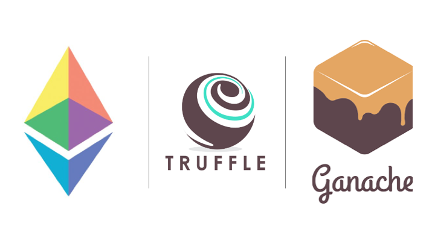

# 9. Testing dan Debugging Smart Contract

Testing dan debugging adalah langkah penting dalam pengembangan smart contract. Mengingat sifat transaksi blockchain yang tidak dapat diubah, kesalahan pada kontrak yang sudah di-deploy dapat memiliki konsekuensi serius. Bab ini akan memandu kamu bagaimana best practice dalam testing dan debugging smart contract.

## Pentingnya Testing atau Pengujian

Pengujian smart contract memastikan bahwa setiap fungsi berjalan sebagaimana mestinya dalam berbagai kondisi atau use case tertentu. Pengujian membantu mengidentifikasi bug, kerentanan (vulnerability), dan kesalahan logika sebelum tahap deployment, sehingga mengurangi risiko error yang dapat berdampak fatal.

## Tools untuk melakukan Testing dan Debugging



Berbagai tools tersedia untuk menunjang kebutuhan testing dan debugging smart contract dengan Solidity. Beberapa yang paling populer:

1. **Truffle**  
   Truffle adalah framework pengembangan yang menyediakan berbagai fitur untuk pengujian dan deployment smart contract. Framework ini terintegrasi dengan baik dengan Mocha, sebuah framework testing di JavaScript, yang memungkinkan pengujian unit otomatis pada fungsi smart contract Solidity.  
   [Baca lebih lanjut](https://news.cryptoizresearch.com/apa-itu-framework-truffle-suite-di-dalam-blockchain/)

2. **Hardhat**  
   Hardhat adalah framework untuk pengembangan yang cukup populer serta menawarkan berbagai fitur baik untuk pengujian, debugging, sampai deployment smart contract. Hardhat mendukung TypeScript dan terintegrasi dengan library populer seperti Ethers.js, sehingga memudahkan developer untuk membangun dan menguji smart contract dengan lebih efisien dan cepat.

3. **Ganache**  
   Ganache adalah local blockchain untuk kebutuhan pengembangan project berbasis Ethereum yang memungkinkan kamu untuk mendeploy kontrak dan menjalankan testing dalam suatu lingkup yang terisolasi sehingga tidak berhubungan secara langsung dengan blockchain utama (Mainnet).

4. **Remix IDE**  
   Remix adalah integrated development environment (IDE) online yang memungkinkan untuk menulis, testing, dan debugging smart contract dengan Solidity langsung di browser. IDE ini sangat berguna untuk project skala kecil atau sekadar eksperimen, dengan menawarkan antarmuka yang mudah digunakan dengan tools yang lengkap.

## Menulis test pada Smart Contract

Menulis testing yang tepat sangat penting untuk memastikan fungsionalitas, keandalan, dan keamanan smart contract. Pengujian biasanya dikategorikan berdasarkan ruang lingkup dan tujuannya, seperti unit test, integration test, dan end-to-end test:

### Unit Test

Unit test berfokus pada fungsi atau suatu komponen individual dari sebuah contract, memastikan bahwa setiap bagian berfungsi sebagaimana mestinya secara terpisah. Jenis pengujian ini sangat penting untuk memastikan bahwa setiap bagian spesifik dari fungsionalitas kontrak berjalan dengan benar tanpa dipengaruhi oleh bagian lain. Unit test membantu mendeteksi kesalahan di level paling dasar, sehingga memudahkan dalam perbaikan jika adanya bug.

Contoh menggunakan Truffle:

```javascript
const SimpleStorage = artifacts.require("SimpleStorage");

contract("SimpleStorage", (accounts) => {
   it("should store the value 89", async () => {
      const instance = await SimpleStorage.deployed();
      await instance.set(89, { from: accounts[0] });
      const storedData = await instance.get.call();
      assert.equal(storedData, 89, "The value 89 was not stored.");
   });
});
```

Pada contoh ini, unit test untuk kontrak SimpleStorage memeriksa apakah suatu nilai dapat disimpan dan diambil dengan benar.

### Integration Test

Integration test memastikan interaksi antara beberapa komponen atau kontrak dapat berjalan bersama sesuai dengan yang diharapkan. Pengujian ini sangat penting untuk mendeteksi masalah yang mungkin tidak terlihat saat pengujian komponen secara terpisah.

Contohnya:

```javascript
const Token = artifacts.require("Token");
const Crowdsale = artifacts.require("Crowdsale");

contract("Crowdsale", (accounts) => {
   it("should allow buying tokens", async () => {
      const token = await Token.deployed();
      const crowdsale = await Crowdsale.deployed();

      await crowdsale.buyTokens(accounts[1], {
         from: accounts[0],
         value: web3.utils.toWei("1", "ether"),
      });
      const balance = await token.balanceOf(accounts[1]);
      assert(balance.toNumber() > 0, "Tokens were not transferred.");
   });
});
```

Pada kasus ini, Integration test memastikan bahwa kontrak Crowdsale menangani pembelian token dengan benar dan pembeli menerima token tersebut.

### End-to-End Test

End-to-end test mensimulasikan skenario di dunia nyata dan interaksi pengguna untuk memastikan seluruh sistem berfungsi sesuai yang diharapkan. Pengujian ini memberikan kepastian bahwa smart contract akan bekerja dengan benar ketika di-deploy.

Contoh menggunakan Hardhat:

```javascript
const { expect } = require("chai");
const { ethers } = require("hardhat");

describe("SupplyChain", function () {
   let SupplyChain, supplyChain, owner, addr1, addr2;

   beforeEach(async function () {
      SupplyChain = await ethers.getContractFactory("SupplyChain");
      [owner, addr1, addr2, _] = await ethers.getSigners();

      supplyChain = await SupplyChain.deploy();
   });

   it("Should create an order", async function () {
      await supplyChain.createOrder(1, "Item1", 100);
      const order = await supplyChain.getOrder(0);
      expect(order[0]).to.equal(1);
      expect(order[1]).to.equal("Item1");
      expect(order[2]).to.equal(100);
      expect(order[3]).to.equal(0); // Status.Pending
   });

   it("Should update the order status", async function () {
      await supplyChain.createOrder(1, "Item1", 100);
      await supplyChain.updateOrderStatus(0, 1); // Status.Shipped
      const order = await supplyChain.getOrder(0);
      expect(order[3]).to.equal(1); // Status.Shipped
   });

   it("Should not update the status of a non-existent order", async function () {
      await expect(supplyChain.updateOrderStatus(1, 1)).to.be.revertedWith(
         "Invalid order ID"
      );
   });

   it("Should retrieve an existing order", async function () {
      await supplyChain.createOrder(1, "Item1", 100);
      const order = await supplyChain.getOrder(0);
      expect(order[0]).to.equal(1);
      expect(order[1]).to.equal("Item1");
      expect(order[2]).to.equal(100);
      expect(order[3]).to.equal(0); // Status.Pending
   });

   it("Should revert when trying to get a non-existent order", async function () {
      await expect(supplyChain.getOrder(1)).to.be.revertedWith(
         "Invalid order ID"
      );
   });
});
```

Pengujian end-to-end ini memeriksa alur pembelian lengkap dalam kontrak SupplyChain, memastikan bahwa data order dicatat dan diperbarui dengan benar.

## Best Practice dalam Pengujian

Berikut beberapa cara terbaik saat menguji kontrak Solidity:

### Test Coverage

Usahakan testing mencakup semua kemungkinan skenario, termasuk kondisi normal dan kondisi gagal. Cakupan pengujian yang lengkap akan memastikan bahwa kontrak berperilaku sesuai yang diharapkan dalam berbagai situasi dan membantu mengidentifikasi potensi bug sejak awal.

### Test untuk celah keamanan

Sertakan testing untuk mencegah kerentanan umum seperti reentrancy, integer overflow, dan masalah kontrol akses guna memastikan keamanan pada smart contract.

### Pertahankan hasil yang konsisten

Pastikan pengujian menghasilkan hasil yang konsisten dan tidak dipengaruhi oleh faktor eksternal seperti latensi jaringan atau ketergantungan waktu.

## Teknik Debugging

Debugging smart contract adalah proses penting untuk memastikan bahwa kontrak kamu berfungsi dengan benar dan aman. Karena transaksi blockchain tidak dapat dibatalkan, mengidentifikasi dan memperbaiki bug sejak awal sangatlah penting. Berikut adalah beberapa teknik dan alat yang umum digunakan untuk debugging smart contract:

### Menggunakan Remix Debugger

Remix IDE memiliki fitur debugger yang memungkinkan kamu untuk melakukan tracing pada saat mengeksekusi contract, menginspeksi variabel, sampai menganalisa call stack.

### Logging dengan Event

Emit events untuk mencatat informasi penting dan perubahan pada state di dalam kontrak. Ini akan membantu setiap aktivitas contract serta bisa digunakan untuk mengidentifikasi masalah.

Contoh sederhana:

```solidity
// SPDX-License-Identifier: MIT
pragma solidity ^0.8.0;

contract Voting {
     event Voted(address indexed voter, uint candidate);

     mapping(address => bool) public hasVoted;

     function vote(uint candidate) public {
          require(!hasVoted[msg.sender], "Already voted");
          hasVoted[msg.sender] = true;
          emit Voted(msg.sender, candidate);
     }
}
```

### Menggunakan Hardhat Console

Hardhat menyediakan module console yang dapat digunakan untuk kebutuhan pengujian dan debugging kontrak dengan cara melakukan import langsung ke dalam kode Solidity.

Contoh:

```solidity
pragma solidity ^0.8.0;

import "hardhat/console.sol";

contract Token {
  //...
  function transfer(address to, uint256 amount) external {
     require(balances[msg.sender] >= amount, "Not enough tokens");

     console.log(
          "Transferring from %s to %s %s tokens",
          msg.sender,
          to,
          amount
     );

     balances[msg.sender] -= amount;
     balances[to] += amount;

     emit Transfer(msg.sender, to, amount);
  }
}
```

### Gunakan Revert

Gunakan statement require, assert, dan revert dengan pesan error yang jelas untuk mempermudah proses debugging.

Contoh:

```solidity
// SPDX-License-Identifier: MIT
pragma solidity ^0.8.0;

contract Bank {
     mapping(address => uint) public balances;

     function withdraw(uint amount) public {
          require(balances[msg.sender] >= amount, "Insufficient balance");
          balances[msg.sender] -= amount;
          (bool success,) = msg.sender.call{value: amount}("");
          require(success, "Transfer failed");
     }
}
```

## Contoh: Menguji Contract yang kompleks

Sebagai contoh kita akan membuat pengujian kontrak yang lebih kompleks menggunakan Hardhat dan Ethers.js.

### Token Contract

```solidity
// SPDX-License-Identifier: MIT
pragma solidity ^0.8.0;

import "@openzeppelin/contracts/token/ERC20/ERC20.sol";
import "@openzeppelin/contracts/access/Ownable.sol";

contract MyToken is ERC20, Ownable {
     constructor() ERC20("MyToken", "MTK") {
          _mint(msg.sender, 1000 * 10 ** decimals());
     }

     function mint(address to, uint256 amount) public onlyOwner {
          _mint(to, amount);
     }
}
```

### Menguji kontrak token dengan Hardhat dan Ethers.js

Dalam contoh ini, kita akan menulis test untuk memeriksa hal-hal berikut:

-  Initial token supply dialokasikan dengan benar kepada peng-deploy kontrak.
-  Owner bisa mencetak (mint) token baru.
-  Token bisa di transfer antar akun.

```javascript
const { expect } = require("chai");
const { ethers } = require("hardhat");

describe("MyToken", () => {
   let MyToken, token, owner, addr1, addr2;

   beforeEach(async () => {
      [owner, addr1, addr2] = await ethers.getSigners();
      MyToken = await ethers.getContractFactory("MyToken");
      token = await MyToken.deploy();
   });

   describe("Deployment", () => {
      it("Should assign the total supply of tokens to the owner", async () => {
         const ownerBalance = await token.balanceOf(owner.address);
         expect(await token.totalSupply()).to.equal(ownerBalance);
      });
   });

   describe("Transactions", () => {
      it("Should transfer tokens between accounts", async () => {
         // Transfer 50 tokens from owner to addr1
         await token.transfer(addr1.address, 50);
         const addr1Balance = await token.balanceOf(addr1.address);
         expect(addr1Balance).to.equal(50);

         // Transfer 50 tokens from addr1 to addr2
         await token.connect(addr1).transfer(addr2.address, 50);
         const addr2Balance = await token.balanceOf(addr2.address);
         expect(addr2Balance).to.equal(50);
      });

      it("Should fail if sender doesn't have enough tokens", async () => {
         const initialOwnerBalance = await token.balanceOf(owner.address);

         // Try to send 1 token from addr1 (0 tokens) to owner (should fail)
         await expect(
            token.connect(addr1).transfer(owner.address, 1)
         ).to.be.revertedWithCustomError(MyToken, "ERC20InsufficientBalance");

         // Owner balance shouldn't have changed.
         expect(await token.balanceOf(owner.address)).to.equal(
            initialOwnerBalance
         );
      });
   });

   describe("Minting", () => {
      it("Should allow owner to mint new tokens", async () => {
         await token.mint(owner.address, BigInt(100 * 10 ** 18).toString());
         const ownerBalance = await token.balanceOf(owner.address);
         expect(ownerBalance).to.equal(BigInt(1100 * 10 ** 18));
      });

      it("Should not allow non-owner to mint tokens", async () => {
         await expect(
            token.connect(addr1).mint(addr1.address, 100)
         ).to.be.revertedWithCustomError(MyToken, "OwnableUnauthorizedAccount");
      });
   });
});
```

### Penjelasan

#### Bagian Deployment:

Test pertama memverifikasi bahwa total supply token diberikan dengan benar kepada pemilik kontrak saat deploy dilakukan. Hal ini memastikan bahwa proses inisialisasi kontrak mengalokasikan seluruh supply kepada pemilik kontrak, sehingga state awal diatur dengan benar.

#### Bagian Transaksi:

Hal pertama yang diuji di bagian ini akan memeriksa apakah token dapat di transfer antar akun sebagai fungsi inti dari kontrak token. Test kedua memastikan bahwa transfer gagal jika pengirim tidak memiliki cukup token.

#### Bagian Minting:

Pengujian bertujuan memastikan bahwa hanya pemilik kontrak yang dapat mencetak (mint) token baru, memastikan kontrol akses berjalan dengan baik dan menjaga integritas supply token. Test kedua mengonfirmasi bahwa minting gagal jika dilakukan oleh bukan pemilik.
